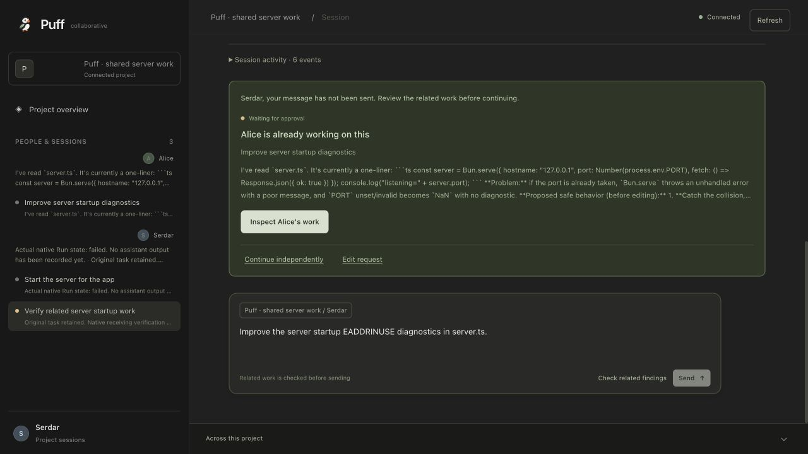

# Real Alice current-work verification — September 29

Tested source: `7e431eb9a536d94e46f60d90047790c8173da72d`, integrating own `ff601ebaf5` and incoming `origin/serhat` `081f15b74b`. The isolated checkout is `/Users/mac/Desktop/Coding/Hackathon/Puff/PuffCollaborative-alice-product`. Incoming product, backend, consent and sharing work was retained. Publication is to `serhat`; main is unchanged by this task.

The user supplied a replacement Flower model key. It is stored privately outside Git with owner-only permissions; the model catalog returned HTTP 200 and listed Endeavor. The old credential's HTTP 401 checkpoint remains historical evidence. No key or member password is in this receipt, browser data or staged source.

## Actual provider and native evidence

The isolated native backend at `127.0.0.1:4484` uses actual SQLite, Git workspaces, Sessions, coordination queues and the embedded OpenCode runner. Mock execution is disabled. Alice and Serdar are names for the controlled two-member example; their tasks and `server.ts` repository are authored fixture inputs. Assistant/tool outputs come from actual Flower Endeavor requests, not seeded replies or a local deterministic model.

- Alice Session `ses_alice_preview`, Thread `thr_758bff92-50c3-436d-9dde-4e7c16fb7aec`, Run `run_5402f564-35a1-44b2-83a0-eb000ac56168` performed real glob/read calls and produced a startup-diagnostics proposal. Native message `msg_0efb64c12001LBZ62Au4ASfJ5C`, sequence 14, contains the model text and pending edit call.
- Shared output `evt_0efb64c21001AtnUPMlCNcDbgr`, project sequence 37, is the exact source inspected by the product. Card version 4 cites it and reflects Thread activity 38. Alice's actual Run is `waiting_approval`; approval `apr_per_0efb64c23001v4yJ6oMTv22qMz` remains pending at version 1. No edit was approved or applied by this test.
- Original Serdar Run `run_37f7e6c3-8ce4-4b94-a589-6f68c7b0b425` produced real tool receipts, then failed. Native message `msg_0efb528dd001nR0HmHveOz7to4`, sequence 28, records HTTP 429 with provider code `secret_key_credit_limit_reached`. This is not an authentication failure or a generic rate-limit classification. Local zero usage fields do not establish zero provider cost.

[Sanitized persisted evidence](2026-09-29-alice-real-overlap.json) retains native message/Run/approval identities and the final source/target snapshot. Private native receipts remain in the disposable runtime directory.

## Independently exercised browser flow

The production Next.js process on port 3010 was rebuilt from the merged source. Its `/live` API reads the actual backend using private server-side member authentication. The still-running 4484 worker was started before the incoming backend merge; it was preserved to retain the real pending approval. Fresh merged-backend compatibility is checked separately by the local integration suite below.

The operator opened Serdar's receiving Session, typed `Improve the server startup EADDRINUSE diagnostics in server.ts.` and clicked Send. The product checked fresh shared current work before admission, showed **Alice is already working on this** and **Waiting for approval**, and stated that the message had not been sent. Exact inspection displayed the actual output at sequence 37 and Alice's original task. The receiving Thread still contained just its original instruction.

The fresh receiving Thread is `thr_4b50ed53-8b9e-4735-9a84-61a077fd64a3`, Session `ses_serdar_bounded`. Its retained original task was copied as a real owner instruction then cancelled while queued; it was not re-executed. The helper created no provider request. **Send with this context** was not clicked and this Thread was not reserved. The original failed Thread remains intact.

A stale in-app-browser client initially retained old assets after server restart. A fresh tab loaded the current credit-limit label and sharing labels; the actual overlap flow was repeated there. Screenshots are direct captures, with no substituted message content.

## Verification at the merged source

- `npm test` in `apps/web`: 94 pass. Incoming transport tests require disposable loopback listeners; sandbox EPERM was resolved by running those permitted local tests with escalation.
- `npm run typecheck` and the Next.js production build pass.
- `bun test` in `hackathon/alice-preview`: 13 pass, 181 assertions. Tests exercise exact current source/Run binding, owner/project access, default-submit interception, stale-source rejection, idempotent context admission, actual native config loading and trusted Session selection. A fresh merged service reproduces and fixes the bounded helper's missing exact Session grant; another owner and unshared Sessions remain denied.
- The actual Responses serialization test uses the native model layer and an in-memory HTTP client, verifies `max_output_tokens: 1024` and no tools, and makes no external request.
- Repository pre-push hook: 21 successful typecheck tasks, 15 cached. Whitespace checks pass. Independent source review found no new serious defect.

After the credit error, the launcher was bounded to Alice four steps and receiving text-only one step, with 1024 output tokens per request. Those bounds were verified locally; the newly bounded receiving Session has not executed against Flower. The native executor may retry a rate-limit response twice, so one step can mean up to three HTTP attempts. A token cap is not a provider spending cap.

## Remaining boundaries

The key's 100-credit lifetime limit was reached. Increasing it to 1,000 credits and running the receiving-context test is pending explicit spending approval; no increase was saved. Therefore this receipt establishes actual provider access and current-work interception, not successful receiving-agent interpretation of Alice's source or a completed server fix.

Matching is a bounded lexical check over current shared task text. It is not semantic Flower Guardian analysis. Source validation and the final target read occur before a separate queue POST; the backend has no atomic expected-revision condition for this path. A concurrent change can occur between review and admission. Context is attributed review-time information, never proof that a fix was applied.

The default combined product controller remains separate from this single-member `/live` example. Hosted multi-user authentication, general semantic coordination, active-session steering and live WF02/WF10 acceptance are not established by this receipt. The fixture names, repository and input tasks remain distinct from the real provider and native execution evidence.
