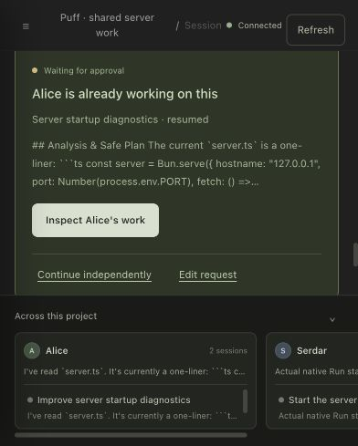

# Approval-wait recovery and real Alice overlap

Backend source tested: `ccfb9d21968ccc6c1c3715eaef56f3cdd0e1aceb`, isolated checkout `/Users/mac/Desktop/Coding/Hackathon/Puff/PuffCollaborative-alice-product`. Publication is to `serhat`. The retained Next.js production process serves `/live` on port 3010; the repaired pure native backend runs on 4484 with mock execution disabled. Runtime configuration, member credentials and the Flower key stay outside Git. This receipt supersedes the previous receipt's pending credit-cap approval statement, without replacing its historical results.

## Recovery result

The backend process had stopped. After restart, original Alice Session `ses_alice_preview`, Thread `thr_758bff92-50c3-436d-9dde-4e7c16fb7aec`, Run `run_5402f564-35a1-44b2-83a0-eb000ac56168` was locally held while its shared state still said `waiting_approval`. The fix verifies the current command, owner, attempt, Session and durable delivery ordering before publishing the hold. It reads the full durable state tail, including backlogs beyond 128 callbacks, and refuses to append or flush when ownership or delivery is blocked.

Restarting the same SQLite runtime published callback `runner_cb_67b38096-d248-4d9e-8f57-ec598e35c5ca`, producer key `recovery:hold:waiting_approval`, ordinal 10. It was acknowledged and both local and shared Run states became `recovery_required`. Original Alice/Serdar native input count stayed 2 and message count stayed 9. Recovery did not resume a promoted input, approve an edit, or call the provider. The old process-local permission continuation remains unrecoverable through the existing API; history is retained.

## Live source and browser result

The user increased the existing key's lifetime cap to 1,000 credits. A fresh Alice Session was created through authenticated, owner-bound provisioning. Its initial Run encountered a real Flower provider failure; one explicit continuation produced actual model output and a new edit permission boundary.

- Session `ses_2cd8d7779d236ad126b3460c1ad1ba61ba50b16e`, Thread `thr_abba0445-2832-4c8b-838d-43a47b1937dd`.
- Run `run_f6e23352-1807-4d28-8b52-23b26823124e` is `waiting_approval`. Approval `apr_per_0effb1b7e0013Nr1XU2out5R1s` is pending at version 1; no decision was delivered.
- Native message `msg_0effb1b69001jd95aWqkfjOOjB` produced shared output `evt_0effb1b80001plxhk4s6bnz7eW`, sequence 66. WorkCard version 2 cites it at activity 67. Owner settings permit local summary projection; text analysis and hosted awareness remain disabled.

Serdar's matching request showed **Alice is already working on this**, before instruction admission. Exact inspection displayed source event 66, the current waiting Run and original owner task. **Send with this context** admitted one attributed instruction, preserving the receiving request and source revision. SQLite confirms native promotion with the current Alice output cited. The receiving model did not complete: the initial request and one explicit retry failed with actual Flower SSE error `server_error: Flower Endeavor providers failed.` No assistant response was substituted.

A separate fresh owner-provisioned Serdar Session tested a two-step, deny-all-tools configuration without restarting Alice. It also failed with the same provider error, so that proposed source configuration change was discarded. Both receiving histories remain intact. A direct diagnostic containing only the generated `server.ts` fixture and EADDRINUSE prompt completed with HTTP 200 and the same 1024-token cap. Another fixture-only diagnostic with system context, `store: false`, invented cache/affinity metadata and that same cap returned actual text before `response.incomplete`. Neither response was injected into a native Session. Native dry serialization found no tools, forced tool choice, reasoning options or duplicate token budget in the two-step first request. The cause of the difference remains unresolved.

[Sanitized persisted identities and states](assets/2026-09-29-approval-wait-recovery.json) record recovery, native promotion, pending approval and provider failures. The names, repository and tasks are controlled fixture inputs; provider outputs, native tools, permissions, SQLite and coordination execution are real.

## Verification

- Core: `bun test test/runner-harness/recovery.test.ts test/runner-harness/report-delivery.test.ts test/runner-harness/lifecycle.test.ts --only-failures` — 54 pass, 234 assertions. `bun typecheck` passes.
- Alice-preview: `bun test --only-failures` — 13 pass, 181 assertions. Disposable loopback tests required sandbox escalation; an initial restricted run's EPERM failures were environmental.
- Formatting and `git diff --check` pass. Independent source review found no remaining important defect after the delivery-ordering regression was fixed.

This proves backend reachability, durable recovery reporting, real Alice current-work interception, exact inspection and receiving-input promotion. It does not prove receiving-agent interpretation, a completed server fix, semantic Flower Guardian coordination, or admission into an already active coding turn. WF02/WF10 and broader product gates remain open. Matching remains the existing bounded lexical check with review-time source validation and a separate queue POST.
