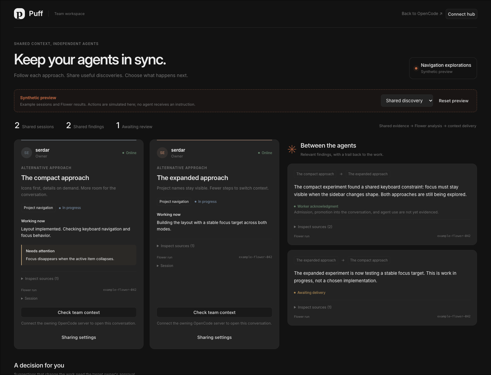
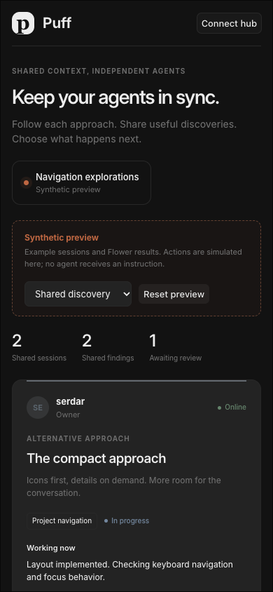

# Serdar T3 — interface and synthetic workflow evidence

Date: September 29, 2026, 12:32 PDT.
Owner: Serdar. Implementation and browser checks: Codex in Serdar's UI chat. An independent read-only code reviewer identified four issues; the implementation agent fixed and checked them. A teammate has not yet independently reproduced this receipt.

Result: **PASS for the UI checks below; BLOCKED for live collaboration.**
Evidence kind: **SOURCE, UNIT, FIXTURE**. No INTEGRATION or LIVE gate is closed.
Tested code: [`3f7571823468fba62e86810e16ddc0b5f13a9b44`](https://github.com/uzgorenm/PuffCollaborative/commit/3f7571823468fba62e86810e16ddc0b5f13a9b44). All listed commands were rerun at that commit with a clean checkout. Browser walkthroughs used the same UI source immediately before committing; incoming backend changes were disjoint. This receipt and screenshots are a documentation-only follow-up.

## Delivered scope

`/puff` is part of the existing OpenCode SolidJS frontend. It displays separate same-owner experiments, sources, work state, findings, reviewable instructions and accepted decisions. Both existing home layouts have a Team workspace link (source-reviewed); the direct `/puff` page was exercised in the browser without an execution backend. Existing conversations remain in OpenCode and require a configured, verified server mapping to open.

Preview sessions, Flower IDs, response text and acknowledgments are explicitly synthetic. Default connection uses the current Basic-auth status endpoint. Its backend handler is a 503 scaffold at this code version; only the client request/error behavior was unit-tested, not a running authenticated backend. A development-only provisional API option permits HTTP fixture tests and stays visibly labeled. Production omits that option.

## Automated results

Environment: macOS, Bun 1.3.14, repository lockfile, commands from `packages/app`.

| Command | Actual result |
| --- | --- |
| `bun test --conditions=solid src/pages/puff src/i18n/parity.test.ts` | 18 pass, 0 fail, 1018 assertions (13 Puff tests and 5 locale parity tests). |
| `bun typecheck` | Exit 0. |
| `bun run build` | Exit 0; production built in 9.54 seconds. Existing large-chunk warning remains. |
| `bun run test:browser` | 41 pass, 0 fail, 100 assertions. These are browser-condition tests, not end-to-end browser automation. |
| `bun run test:unit` | 736 pass, 1 fail. `desktop-native.test.ts:123` expects `pa-PK` → `pa`, receives `en`. The locale detector and its test are unchanged by this commit; this failure was also observed before the final UI changes. |
| `git diff --check` and Prettier on owned UI files | Pass. |

No dependency manifest or lockfile was changed. Puff copy uses the typed translation API; other locales explicitly use English fallback pending translation review.

## Browser observations

Automated interaction used agent-browser with the real local Vite page at `http://127.0.0.1:4444/puff`. The additional HTTP service was a temporary synthetic fixture on port 4455; it was neither the team service nor Flower/OpenCode execution. Its public test controls were not added to the product.

| Check | Observed behavior and limit |
| --- | --- |
| Layout and navigation | Direct page renders at 1440×1100 and 390×844. Mobile has no horizontal overflow or Vite error overlay. Screenshots below show synthetic content. Original session links remain unavailable without their owning server mapping. |
| Source inspection | Evidence details show exact selected worker/session/activity references as text. Missing or changed evidence makes affected review stale. |
| Human review | Edit/approve/reject work in preview. Approval stays pending without a matching receipt. Accepting an edited instruction stores the edited text as the decision. This is not durable project memory. |
| Late updates | A changed proposal during editing requires loading the current version and disables approval of the old review. |
| Sharing | Topic edits, mute and unshare update the synthetic preview. Unshare removes the card and invalidates dependent review. Reset restores both original sessions and fresh form state. |
| Pending job and reconnect | In the HTTP fixture, a pending context check disables another check while mute/unshare remain usable. Disconnect/reconnect retains the request ID and the fixture recorded one context POST, not a duplicate. Completion releases the pending ID. |
| Rejection and lost response | HTTP 422 submission rejection releases the pending lock. Ambiguous outcomes retain it. A failed snapshot poll shows cached/disconnected state and disables mutations; recovery refreshes the state. |
| Untrusted text and credentials | Model text containing an HTML image/event-handler payload did not create an image or execute. The synthetic member credential was absent from local/session storage; only service/project-scoped pending request IDs were retained. |

The independent review found: reconnect losing a pending job, accepted decisions ignoring edited text, pending jobs disabling mute/unshare, and definite submission failure retaining a lock. All four were fixed and checked. The committed tests preserve the API/state portions of these checks; browser observations are fixture evidence only.

## Gate and workflow limits

- G0 remains blocked: Serhat's authoritative snapshot/action/identity contract differs from the provisional UI schema. The current status route does not expose the necessary shared state or operations. See the [UI handoff](../../../packages/app/src/pages/puff/README.md).
- G3/G5 remain open: no real Flower participants, run/task identities, source event sequence, target message/admission ledger, promotion, or agent use were exercised. All such runtime receipt fields are **not exercised**. An acknowledgment explicitly does not establish admission, promotion or use.
- WF01–WF07 are **not passed** by this receipt. Stale/offline/security/retry checks cover UI handling with units/fixtures, not the end-to-end acceptance cases. WF08/WF09 controls are previewed, not proven against persistent backend state. WF10 is not exercised.
- Serhat supplies registered authenticated shared-state/actions and receipt representations; Talha supplies real source capture and target admission/promotion/use evidence; Ferit supplies real Flower exchange. Serdar then replaces the provisional adapter, renders each actual state, and runs the two fresh WF02 rehearsals.

The visible page and passing build prove that the interface can be reviewed now. They do not prove that agents collaborate or that a submission is ready.
